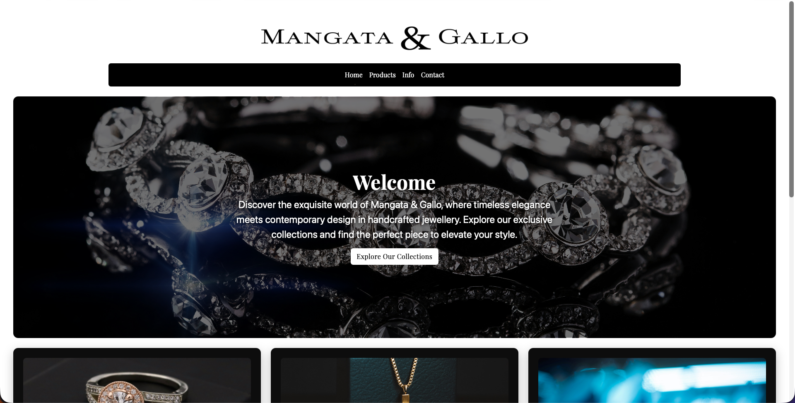
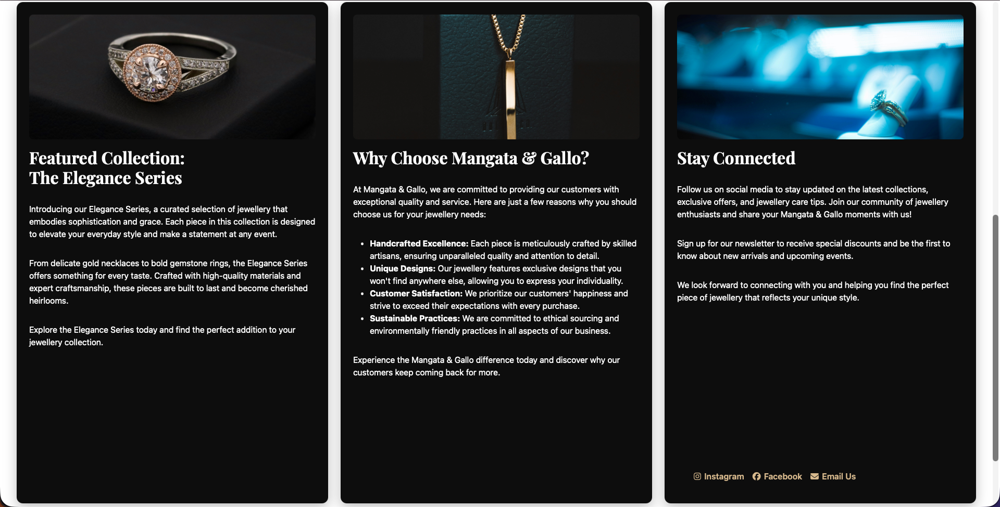

Mangata & Gallo – Portfolio Project

A luxury jewellery homepage built with semantic HTML, responsive CSS (Grid + Flexbox), and enhanced interactivity.

📌 About the Project

This project was created as part of the Portfolio Project – HTML & CSS in Depth course from Meta.
The goal was to design and build a professional, responsive home page for a fictional business using the core web-development principles taught throughout the course.

For this project, I selected the fictional luxury jewellery brand Mangata & Gallo, known for elegant, handcrafted designs made for special occasions such as engagements, weddings, and anniversaries.

The assignment focused on mastery of:
	•	Visual layout
	•	Semantic HTML structure
	•	CSS layout techniques (Grid / Flexbox)
	•	Styling for a specific target audience
	•	Interactivity using pseudo-classes and CSS effects

This home page represents the fictional brand’s aesthetic: luxurious, elegant, modern, and timeless.

🛠️ Features & Requirements Implemented

✔ Semantic HTML Structure
	•	header containing the main logo
	•	nav bar with four links
	•	main section with:
	    •	A large promotional banner
	    •	Three feature columns, each containing an image and descriptive text
	•	footer with two columns:
	    •	Small logo
	    •	Copyright information

✔ Responsive CSS Layout
	•	CSS Grid layout for the main content
	•	Adaptive breakpoints for desktop / tablet / mobile
	•	Flexbox used in components for internal alignment
	•	Clean, well-formatted stylesheet

✔ Interactivity & Effects
	•	Navigation underline hover animation
	•	Gold sweep underline animation for section titles when navigated
	•	Button hover transitions (color, shadow, and movement)
	•	Subtle card shadows and depth effects
	•	Dark luxury-themed color palette

✔ Branding & UX
	•	Custom imagery (luxury rings, pendants, presentations)
	•	Elegant font: Playfair Display
	•	Consistent gold-on-black aesthetic
	•	Section content tailored to the brand’s premium audience
	•	Encourages engagement with CTA buttons, contact prompts, and social links

⸻

🧰 Technologies Used
	•	HTML5 (semantic, accessible structure)
	•	CSS3 (custom design system, animations, responsive grid)
	•	Bootstrap 5 (lightly used for layout utilities)
	•	Font Awesome (icons)
	•	Google Fonts
	•	JavaScript (tiny script for triggering underline animation)

⸻

🏆 Assessment Results

This project passed the course’s peer-review evaluation with:

⭐ 24 / 26 points

Highlights from peer feedback:
	•	Clean, error-free HTML & CSS
	•	Effective layout and clear brand identity
	•	Good use of pseudo-classes and visual effects
	•	Layout adapts well across screen sizes
	•	Appropriate styling for a luxury jewellery audience

⸻

📸 Screenshots (Optional)

Add your project screenshots here using Markdown if desired.

⸻

📂 Folder Structure

/
├── index.html
├── styles.css
└── images/
     ├── Asset 1@3x.png
     ├── Asset 2@3x.png
     ├── Ring-sabrianna-unsplash.jpg
     ├── Pendant-alex-unsplash.jpg
     └── Present-brooks-unsplash.jpg

⸻

🚀 How to View

Simply open index.html in your browser.
Ensure the styles.css and the /images folder are in the same directory.

⸻

Design Philosophy

For Mangata & Gallo, I aimed for a luxurious, timeless, and elegant mood by using:
	•	High-contrast dark backgrounds
	•	Gold accents and subtle animations
	•	Serif typography for sophistication
	•	High-quality product photography

The result is a polished online storefront that reflects exclusivity and craftsmanship.

⸻

💬 Final Thoughts

This project was an excellent opportunity to demonstrate mastery of HTML and CSS fundamentals while building something visually meaningful and brand-driven.
I’m proud of this submission and excited to continue enhancing my front-end development skills.